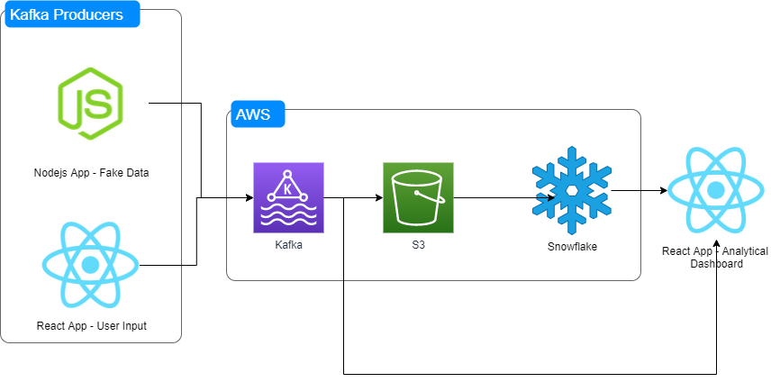

# Data Engineering Realtime Data

I have created this project to demo real time reporting performance for various architectures.

## Architecture

## Components

- Kafka Producer - Nodejs app generating fake data
- Kafka Producer - React app that will send data from a UI to Kafka
- Kafka
- Kafka Consumer - Nodejs
- Kafka Consumer - React
- S3 - staging data between Kafka and Snowflake
- Snowflake - Snowpipe
- Analytics React App

## Why kafka
Kafka acts as a broker thus decoupling your consumers and producers! 
This drastically reduces the number of integrations required.

## Performance
- Kafka Producer -> Kafka -> Kafka Consumer -> React App
- Kafka Producer -> Kafka -> S3 -> Snowflake -> React App

## Challenges
### How to deal with data loss - TODO
Kafka producers will can choose different levels of data loss checks (acknowledgements aka akns 1-3).

1. producer does receives acknowledgement
2. producer checks acknowledgment from kafka parent partition
3. producer check that acknowledgment has occured from kafka parent and replicas partitions.

To implement a batch check vs stream.

### Number of Kafka Partitions vs consumer
TODO